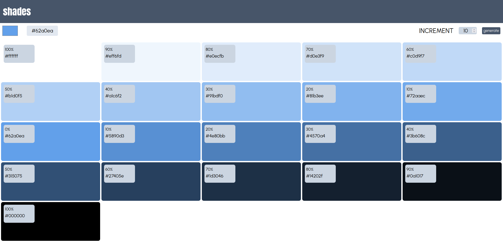

# SHADES

**Preview:**

The Shades App is a simple and intuitive application that allows users to generate shades of a selected color, ranging from white to black. This app is designed to assist designers, artists, developers, and anyone working with colors to quickly explore and visualize different shades within a color spectrum.
Features

- **Color Selection:** The app provides a color picker tool that allows users to select any color they desire as the base color for generating shades.
- **Range of Shades:** The app provides a input to range of increment t0 select from 1 to 100 and select the value or type the value for generating shades.

- **Shade Generation:** Once a color is selected, the app generates a range of shades by progressively adjusting the color's saturation or lightness, transitioning from the base color to white and black.
- **Preview and Comparison:** Users can view the generated shades in real-time and compare them side by side to easily determine which shade best suits their needs.
- **Copy Color Codes:** The app provides the option to copy the hexadecimal codes of any shade with a single click, making it convenient to use the generated shades in other design applications or projects.
